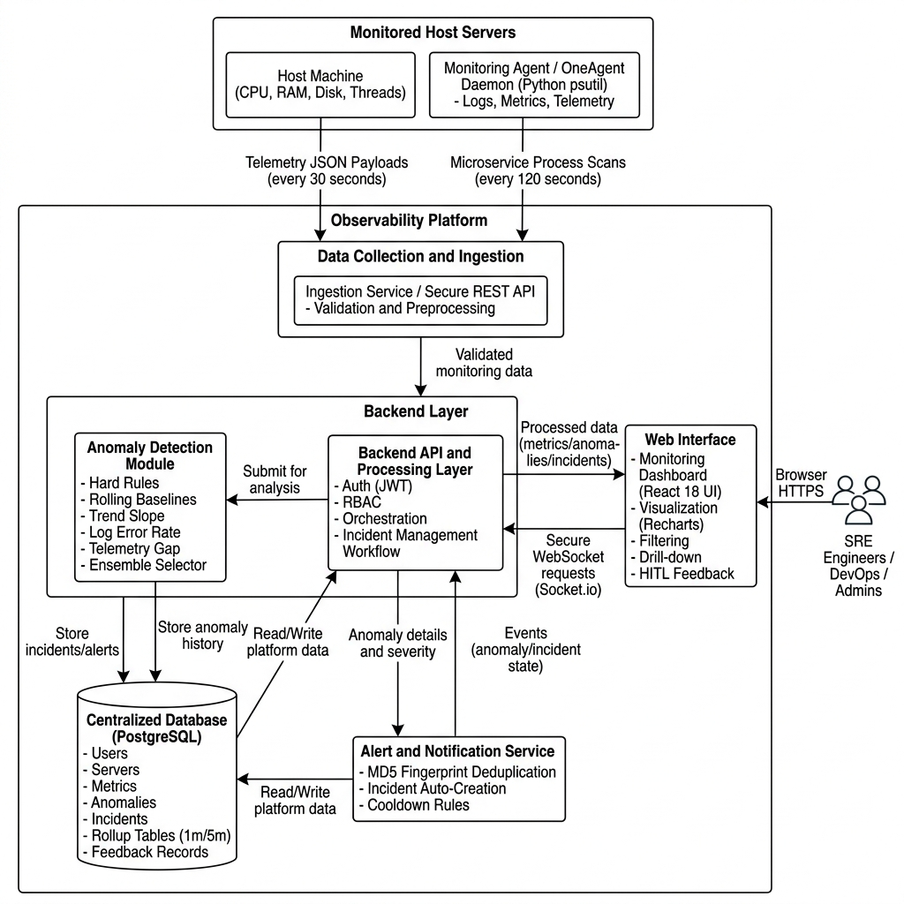

# 🛡️ CloudSight — AI-Powered Enterprise Observability & Incident Platform

[](https://nodejs.org/)
[](https://reactjs.org/)
[](https://www.typescriptlang.org/)
[](https://www.python.org/)
[](https://www.postgresql.org/)
[](https://socket.io/)
[](LICENSE)

A full-stack, enterprise-grade, real-time infrastructure observability platform featuring an **ensemble of 6 Machine Learning anomaly detection models**, automated incident lifecycle management, dynamic alerting, ticket tracking, PDF report generation, and real-time WebSocket dashboard streaming.

---

## 📑 Table of Contents
- [🌟 Key Capabilities & Features](#-key-capabilities--features)
- [🤖 ML Anomaly Detection Engine (6-Model Ensemble)](#-ml-anomaly-detection-engine-6-model-ensemble)
- [🏗️ System Architecture](#️-system-architecture)
- [🛠️ Tech Stack](#️-tech-stack)
- [📁 Repository Directory Map](#-repository-directory-map)
- [⚡ Quick Start & Local Setup](#-quick-start--local-setup)
- [🗄️ Database Provisioning](#️-database-provisioning)
- [🧪 Comprehensive Test Suite](#-comprehensive-test-suite)
- [⚙️ Environment Variables Reference](#️-environment-variables-reference)
- [📖 Detailed Documentation Links](#-detailed-documentation-links)

---

## 🌟 Key Capabilities & Features

- 🖥️ **Full-Stack Telemetry Monitoring:** Ingests live host metrics (CPU, Memory, Disk, Thread Counts), process-level metrics, and application performance data via lightweight telemetry agents.
- ⚡ **Real-Time WebSocket Streaming:** Bi-directional event broadcasting via Socket.IO for zero-latency dashboard updates when anomalies are detected, acknowledged, or resolved.
- 🚨 **Automated Incident Lifecycle:** Auto-creates incidents from high-confidence ML anomalies, assigns severity levels (`low`, `medium`, `high`, `critical`), tracks full timeline audit logs, and allows single-click operator acknowledgement and resolution.
- 📊 **Automated PDF Report Generation:** Generates comprehensive PDF reports with metrics breakdowns, system health trends, and incident summary exports using `pdfkit`.
- 🎫 **Integrated Support Ticket System:** Built-in ticketing pipeline for infrastructure request tracking, permission approvals, and incident follow-ups with role-based access.
- 📧 **Automated Email Notifications:** Persistent delivery tracking (`email_sent`, `email_sent_at`) with deduplication lookup indexes to prevent duplicate alert emails.

---

## 🤖 ML Anomaly Detection Engine (6-Model Ensemble)

The platform features an ensemble ML detection pipeline (`ml/app/jobs/score_realtime.py`) running asynchronously to detect system degradations and abnormal behaviors in real-time across 6 specialized detection models:

1. **Strict Hard Rules:** Threshold evaluations against strict upper/lower metric limits (e.g., CPU > 95%).
2. **Rolling Baseline (Statistical Median/IQR):** Dynamic moving median and Interquartile Range (IQR) bounds calculated per server and service.
3. **Trend Degradation (Linear Regression Slopes):** Mathematical slope analysis over rolling windows to catch gradual performance degradation (memory leaks, disk exhaustion).
4. **Scikit-Learn IsolationForest:** Unsupervised machine learning models trained on server/service feature vectors and saved as serialized `.joblib` model artifacts.
5. **Log Pattern Spike Detector:** Error log ratio and log level anomaly detection based on scraped system logs.
6. **Stale Telemetry Detector:** Heartbeat timeout detection for inactive agents and uncommunicative infrastructure nodes.

---

## 🏗️ System Architecture



```
                                 ┌────────────────────────┐
                                 │   Infrastructure Agent │
                                 │    / Mock Telemetry    │
                                 └───────────┬────────────┘
                                             │ HTTP POST Telemetry
                                             ▼
 ┌────────────────────────┐      ┌────────────────────────┐      ┌────────────────────────┐
 │   React + TypeScript   │ ◄──► │  Node.js + Express API │ ◄──► │ PostgreSQL 14 Database │
 │   Vite Frontend Dashboard│ Socket │   Backend Server (9000)│  SQL  │  (Canonical Schema)    │
 └────────────────────────┘ .IO  └───────────┬────────────┘      └────────────────────────┘
                                             │ Realtime Metrics / Rollups
                                             ▼
                                 ┌────────────────────────┐
                                 │  Python ML Engine      │
                                 │  6-Model Anomaly Worker│
                                 └────────────────────────┘
```

---

## 🛠️ Tech Stack

| Layer | Technology & Frameworks |
|---|---|
| **Frontend** | React 18, TypeScript, Vite, TanStack Query, Recharts, Lucide Icons |
| **Styling** | Vanilla CSS (Nebula Dark Design System), Dynamic Micro-Animations |
| **Backend REST API** | Node.js, Express.js (v5), JWT Authentication, bcrypt, Winston Logging |
| **Real-time WebSockets** | Socket.IO (Server & Client) |
| **Database & ORM** | PostgreSQL 14+, `pg` (node-postgres), TimescaleDB ready |
| **Caching Layer** | Redis (ioredis) with automatic in-memory fallback |
| **Machine Learning** | Python 3.10+, Scikit-Learn, NumPy, pandas, Joblib |
| **Testing** | Jest, Supertest (Backend API), Pytest (ML Engine), Vitest (Frontend) |

---

## 📁 Repository Directory Map

```
observability-platform/
├── backend/                  # Node.js Express REST API server
│   ├── src/
│   │   ├── config/           # PostgreSQL & Redis pool configurations
│   │   ├── controllers/      # Route handler logic (Auth, Hosts, Alerts, Reports, etc.)
│   │   ├── middlewares/      # JWT Authentication & error middlewares
│   │   ├── models/           # Database query execution layer
│   │   ├── routes/           # REST endpoint definitions
│   │   └── services/         # Core business logic (Notifications, Reports, Incidents)
│   └── tests/                # Automated Supertest API & Jest Unit tests
├── database/                 # Single Canonical Database Architecture
│   ├── schema.sql            # Master source-of-truth schema (All tables, enums, indexes)
│   └── seed.sql              # Development mock data insertion script
├── frontend/                 # React + TypeScript + Vite web dashboard
│   ├── src/
│   │   ├── app/pages/        # Dashboard pages (Metrics, Alerts, Incidents, Tickets)
│   │   ├── components/       # UI components, navigation, charts, tables
│   │   └── styles/           # Core design system CSS tokens & styles
├── ml/                       # Python Anomaly Detection Engine
│   ├── app/
│   │   ├── detectors/        # 6 Anomaly detector implementations
│   │   └── jobs/             # Real-time scoring worker (`score_realtime.py`)
│   └── artifacts/            # Serialized `.joblib` model artifacts
├── docs/                     # Architecture diagrams & technical specifications
├── mock_agent.py             # Python infrastructure telemetry simulator
└── run_all.sh                # Single-command platform startup script
```

---

## ⚡ Quick Start & Local Setup

### 1. Prerequisites
Ensure you have the following installed on your machine:
- **Node.js**: `v18.0.0+`
- **Python**: `v3.10+`
- **PostgreSQL**: `v14+`
- **Redis** *(Optional — system automatically falls back to in-memory caching)*

---

### 2. Database Provisioning
Run the canonical `database/schema.sql` script to create all tables, enums, ML rollups, and performance indexes:

```bash
# Create database (if not exists)
createdb observability_db

# Provision Canonical Schema (Master Source of Truth)
psql -d observability_db -f database/schema.sql

# Seed local development test data (Optional)
psql -d observability_db -f database/seed.sql
```

---

### 3. Backend Setup
```bash
cd backend
cp .env.example .env     # Configure database credentials & JWT secrets
npm install
npm run dev               # Starts API server on http://localhost:9000
```

---

### 4. Frontend Setup
```bash
cd frontend
npm install
npm run dev               # Starts Vite dashboard on http://localhost:3000
```

---

### 5. ML Engine Setup
```bash
cd ml
python3 -m venv .venv
source .venv/bin/activate
pip install -r requirements.txt
./start_worker.sh
```

---

### 🚀 One-Command Launch (All Services)
You can launch the Backend, Frontend, ML Worker, and Mock Agent simultaneously using the root orchestrator:

```bash
chmod +x run_all.sh
./run_all.sh
```


---

## 🧪 Comprehensive Test Suite

The platform includes automated testing across all layers:

### 1. Backend Integration & API Tests (Supertest)
```bash
cd backend
npm run test:api
```

### 2. Full Regression Suite (Unit + API)
```bash
cd backend
npm test
```

### 3. Test Coverage Report
```bash
cd backend
npm test -- --coverage
```

### 4. ML Engine Tests (Pytest)
```bash
cd ml
pytest
```

---

## ⚙️ Environment Variables Reference

Create a `.env` file inside `backend/` with the following variables:

```env
PORT=9000
NODE_ENV=development

# Database Configuration
DB_HOST=localhost
DB_PORT=5432
DB_NAME=observability_db
DB_USER=postgres
DB_PASSWORD=your_password

# Authentication Secrets
JWT_SECRET=your_super_secret_jwt_access_key
JWT_REFRESH_SECRET=your_super_secret_jwt_refresh_key
JWT_EXPIRES_IN=1h

# Redis Configuration (Optional)
REDIS_HOST=localhost
REDIS_PORT=6379

# Email SMTP Setup (Optional)
SMTP_HOST=smtp.mailtrap.io
SMTP_PORT=2525
SMTP_USER=your_smtp_user
SMTP_PASS=your_smtp_password
```

---

## 📖 Detailed Documentation Links

- [📄 Comprehensive Testing Architecture Documentation](docs/testing-documentation.md)
- [📄 AWS Deployment Step-by-Step Manual](docs/aws-manual-step-by-step-guide.md)
- [📄 AWS Infrastructure Plan](docs/aws-deployment-plan.md)
- [📄 ML Anomaly Detection Engine Deep Dive](docs/anomaly_detection_deep_dive.md)
- [📊 Full System Architecture Diagram](docs/full_architecture_diagram_1786787352402.png)

---

## 📄 License
Distributed under the **MIT License**. See `LICENSE` for more information.
