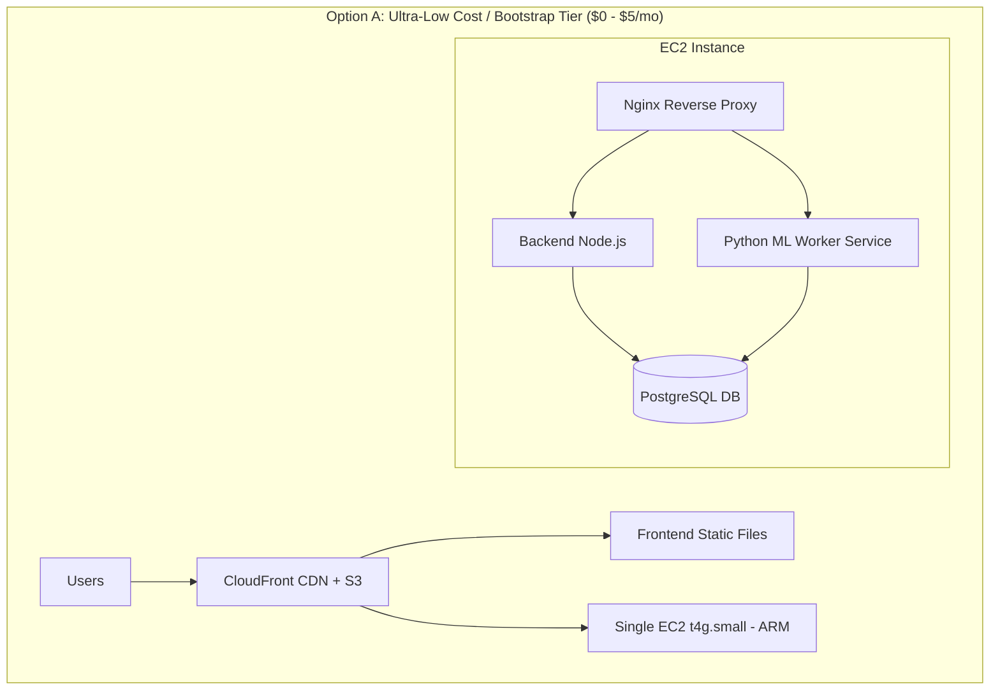

# Comprehensive AWS Deployment & Cost Optimization Plan

This document outlines a complete strategy to deploy the **Observability Platform** (Frontend React/Vite, Backend Express/Socket.IO, PostgreSQL database, and Python ML Anomaly Worker) on **Amazon Web Services (AWS)** with an emphasis on **maximum cost-effectiveness**.

---

## 1. System Architecture Overview

The Observability Platform consists of 4 core sub-systems:

| Sub-system | Technology | Port/Protocol | Deployment Target Requirement |
| :--- | :--- | :--- | :--- |
| **Frontend** | React / Vite / TypeScript | 80/443 (HTTP/S) | Static Web Hosting + CDN |
| **Backend API** | Node.js / Express / Socket.IO | 9000 (HTTP & WebSockets) | Container / Node.js Runtime |
| **Database** | PostgreSQL | 5432 | Managed Relational DB / Self-hosted DB |
| **ML Worker** | Python 3.10 / Scikit-Learn | Background Job (60s cron) | Async Worker / Container / Cron Task |

---

## 2. AWS Architecture Deployment Options

We present **three tailored deployment options** based on your budget and scaling requirements:



---

### Option A: Ultra-Low Cost / Bootstrap Tier (RECOMMENDED for $0–$5/mo)
> [!TIP]
> **Best for:** Portfolios, MVP demonstrations, academic evaluations, and tight budgets.
> Leverages AWS Graviton2 (ARM architecture) which gives 20% higher efficiency and lower cost than standard x86 instances.

* **Frontend**: Hosted on **Amazon S3** with **AWS CloudFront** (CDN) for free global SSL and edge distribution.
* **Backend + ML Worker + Database**: Consolidated into a single ARM-based EC2 instance (`t4g.small` - 2 vCPU, 2GB RAM).
  * **Nginx** handles SSL termination & routes traffic (port 443 -> backend port 9000).
  * **Docker Compose** or **PM2 + Systemd** keeps Backend & ML worker running smoothly.
  * **PostgreSQL** runs locally in a Docker container with attached EBS volume (20GB).

#### Cost Estimation Table (Option A)

| AWS Resource | Details / Pricing Tier | Monthly Cost (Free Tier) | Monthly Cost (Post 1 Year) |
| :--- | :--- | :--- | :--- |
| **EC2 (`t4g.small`)** | 2 vCPU, 2GB RAM (Graviton2 ARM) | $0.00 *(750h Free trial)* | ~$3.50 *(with 1-yr Savings Plan)* |
| **EBS Storage** | 20 GB gp3 SSD volume | $0.00 *(30GB Free Tier)* | ~$1.60 |
| **AWS CloudFront** | CDN, SSL Certificate (ACM) | $0.00 *(1TB/mo free forever)* | $0.00 |
| **Amazon S3** | Static Website hosting | $0.00 *(5GB Free Tier)* | ~$0.10 |
| **Data Transfer Out** | Up to 100 GB/mo | $0.00 | $0.00 |
| **TOTAL ESTIMATED COST** | | **$0.00 / month** | **~$5.20 / month** |

---

### Option B: Managed Serverless & PaaS Tier ($10 – $25/mo)
> [!NOTE]
> **Best for:** Developers who do not want to manage operating system updates, OS patches, or database maintenance.

* **Frontend**: S3 + CloudFront CDN (~$0.10/mo).
* **Backend**: **AWS App Runner** (Fully managed container runner, auto-scales down to 0.25 vCPU / 0.5 GB RAM when idle). Supports WebSockets out-of-the-box (~$7–$12/mo).
* **Database**: **AWS RDS PostgreSQL** (`db.t4g.micro`) or external managed free Postgres (e.g., Neon / Supabase free tier) (~$0–$13/mo).
* **ML Worker**: AWS ECS Fargate scheduled task running once per minute or App Runner background container (~$3–$5/mo).
* **TOTAL COST**: **~$7.00 - $15.00 / month** (during Free Tier year), **~$25.00 / month** thereafter.

---

### Option C: Enterprise Multi-AZ Production Tier ($50 – $80/mo)
> [!WARNING]
> **Best for:** High availability enterprise environments with auto-scaling across multiple availability zones and failover DBs.

* **Frontend**: S3 + CloudFront + AWS Route 53.
* **Backend**: AWS ECS Fargate cluster behind an Application Load Balancer (ALB).
* **Database**: Multi-AZ AWS RDS PostgreSQL (`db.t4g.small`) with automated daily snapshots.
* **Monitoring & Secrets**: AWS Secrets Manager + CloudWatch Alarms & Insights.
* **TOTAL COST**: **~$60.00 - $85.00 / month**.

---

## 3. Containerization Strategy (Docker Setup)

To ensure smooth deployment on AWS, create container specifications for each service:

### A. Backend Dockerfile (`backend/Dockerfile`)
```dockerfile
FROM node:20-alpine
WORKDIR /app
COPY package*.json ./
RUN npm ci --only=production
COPY . .
EXPOSE 9000
CMD ["node", "src/server.js"]
```

### B. ML Worker Dockerfile (`ml/Dockerfile`)
```dockerfile
FROM python:3.10-slim
WORKDIR /app
COPY requirements.txt .
RUN pip install --no-cache-dir -r requirements.txt
COPY . .
CMD ["python", "-m", "app.jobs.run_worker", "--interval-seconds", "60", "--minutes", "60"]
```

### C. Docker Compose Configuration (`docker-compose.yml`)
```yaml
version: '3.8'

services:
  postgres:
    image: postgres:15-alpine
    restart: always
    environment:
      POSTGRES_DB: ${DB_NAME:-observability}
      POSTGRES_USER: ${DB_USER:-postgres}
      POSTGRES_PASSWORD: ${DB_PASSWORD:-postgres_password}
    ports:
      - "5432:5432"
    volumes:
      - pgdata:/var/lib/postgresql/data
      - ./database/schema.sql:/docker-entrypoint-initdb.d/1_schema.sql
      - ./database/ml_anomaly_schema.sql:/docker-entrypoint-initdb.d/2_ml_schema.sql
      - ./database/add_dashboard_indexes.sql:/docker-entrypoint-initdb.d/3_indexes.sql

  backend:
    build:
      context: ./backend
    restart: always
    ports:
      - "9000:9000"
    environment:
      PORT: 9000
      DB_HOST: postgres
      DB_PORT: 5432
      DB_NAME: ${DB_NAME:-observability}
      DB_USER: ${DB_USER:-postgres}
      DB_PASSWORD: ${DB_PASSWORD:-postgres_password}
      JWT_SECRET: ${JWT_SECRET:-super_secret_key}
    depends_on:
      - postgres

  ml-worker:
    build:
      context: ./ml
    restart: always
    environment:
      DB_HOST: postgres
      DB_PORT: 5432
      DB_NAME: ${DB_NAME:-observability}
      DB_USER: ${DB_USER:-postgres}
      DB_PASSWORD: ${DB_PASSWORD:-postgres_password}
      BACKEND_API_URL: http://backend:9000
    depends_on:
      - backend
      - postgres

volumes:
  pgdata:
```

---

## 4. Step-by-Step Implementation Roadmap (Option A Deployment)

### Step 1: AWS Setup & EC2 Provisioning
1. Log in to AWS Management Console.
2. Launch a **`t4g.small` (ARM / Graviton2)** instance running **Ubuntu 24.04 LTS**.
3. Create a Security Group with allowed inbound rules:
   * **SSH (22)**: My IP only
   * **HTTP (80)**: Anywhere `0.0.0.0/0`
   * **HTTPS (443)**: Anywhere `0.0.0.0/0`
4. Attach an Elastic IP to prevent IP address changes on reboot.

### Step 2: Install Runtime Environment on EC2
```bash
# Update system & install Docker + Docker Compose
sudo apt update && sudo apt upgrade -y
sudo apt install -y docker.io docker-compose git nginx certbot python3-certbot-nginx

# Start and enable Docker
sudo systemctl enable --now docker
sudo usermod -aG docker $USER
```

### Step 3: Clone Code & Configure Environment
```bash
# Clone application code
git clone <your-repository-url> /home/ubuntu/observability-platform
cd /home/ubuntu/observability-platform

# Create .env production configuration
cat << 'EOF' > .env
DB_NAME=observability_prod
DB_USER=obs_admin
DB_PASSWORD=SecureStrongPassword123!
JWT_SECRET=e9b87c6a5f4d3e210192837465abcde
PORT=9000
EOF

# Start backend, database, and ML worker containers
docker-compose up -d --build
```

### Step 4: Configure Nginx & SSL Certificate
Create `/etc/nginx/sites-available/observability`:
```nginx
server {
    server_name api.yourdomain.com;

    location / {
        proxy_pass http://localhost:9000;
        proxy_http_version 1.1;
        proxy_set_header Upgrade $http_upgrade;
        proxy_set_header Connection "Upgrade";
        proxy_set_header Host $host;
        proxy_cache_bypass $http_upgrade;
    }
}
```
Enable site and acquire free SSL via Certbot:
```bash
sudo ln -s /etc/nginx/sites-available/observability /etc/nginx/sites-enabled/
sudo nginx -t && sudo systemctl reload nginx
sudo certbot --nginx -d api.yourdomain.com
```

### Step 5: Deploy Frontend on Amazon S3 + CloudFront
1. Build frontend locally or via CI/CD:
   ```bash
   cd frontend
   VITE_API_BASE_URL=https://api.yourdomain.com npm run build
   ```
2. Upload `frontend/dist` contents to an S3 bucket configured for static web hosting:
   ```bash
   aws s3 sync frontend/dist/ s3://my-observability-frontend-bucket --delete
   ```
3. Point CloudFront Distribution to S3 bucket origin and attach free SSL from AWS Certificate Manager (ACM).

---

## 5. Automated CI/CD Pipeline (GitHub Actions)

Create `.github/workflows/deploy.yml` to automatically test, build, and deploy on `git push`:

```yaml
name: Deploy Observability Platform

on:
  push:
    branches: [ main ]

jobs:
  deploy:
    runs-on: ubuntu-latest
    steps:
      - name: Checkout Code
        uses: actions/checkout@v4

      - name: Set up SSH Key
        uses: webfactory/ssh-agent@v0.9.0
        with:
          ssh-private-key: ${{ secrets.EC2_SSH_KEY }}

      - name: Deploy to AWS EC2
        run: |
          ssh -o StrictHostKeyChecking=no ubuntu@${{ secrets.EC2_HOST }} << 'EOF'
            cd /home/ubuntu/observability-platform
            git pull origin main
            docker-compose down
            docker-compose up -d --build
          EOF

      - name: Build & Deploy Frontend to S3
        env:
          AWS_ACCESS_KEY_ID: ${{ secrets.AWS_ACCESS_KEY_ID }}
          AWS_SECRET_ACCESS_KEY: ${{ secrets.AWS_SECRET_ACCESS_KEY }}
          AWS_REGION: 'us-east-1'
        run: |
          cd frontend
          npm ci
          VITE_API_BASE_URL=https://${{ secrets.API_DOMAIN }} npm run build
          aws s3 sync dist/ s3://${{ secrets.S3_BUCKET_NAME }} --delete
          aws cloudfront create-invalidation --distribution-id ${{ secrets.CLOUDFRONT_DIST_ID }} --paths "/*"
```

---

## 6. Proactive AWS Cost Optimization Checklist

1. **Leverage AWS Graviton2 (`t4g` instances)**: ARM instances cost **20% less** and offer up to **40% better price-performance** than equivalent x86 (`t3`) instances.
2. **Use 1-Year Compute Savings Plans**: Purchasing a 1-year Savings Plan for your EC2 instance cuts compute costs by **35% to 40%** (reducing EC2 from ~$6/mo down to ~$3.50/mo).
3. **Set CloudWatch Log Retention**: By default, CloudWatch retains logs forever. Set log retention to **7 days** to prevent unexpected log storage charges.
4. **Clean Up Unused EBS Snapshots**: Ensure old EBS snapshots and unattached volumes are purged regularly.
5. **Utilize AWS Free Tier Thresholds**: CloudFront provides **1 TB of data transfer out** and **10,000,000 HTTP requests** free every month indefinitely.

---

## 7. Open Questions / Next Steps for User Review

> [!IMPORTANT]
> **Please review the following configuration options:**
> 1. Do you already have an **AWS Account** and a **Custom Domain Name** (e.g. from Namecheap/Route53), or would you prefer a setup using AWS default endpoints?
> 2. Which deployment option matches your preference?
>    * **Option A**: Ultra-low cost ($0-$5/mo, EC2 single instance dockerized).
>    * **Option B**: Managed serverless ($10-$25/mo, AWS App Runner + RDS).
> 3. Would you like me to generate the `Dockerfile`s and `docker-compose.yml` directly in your workspace repository so they are ready for deployment?
